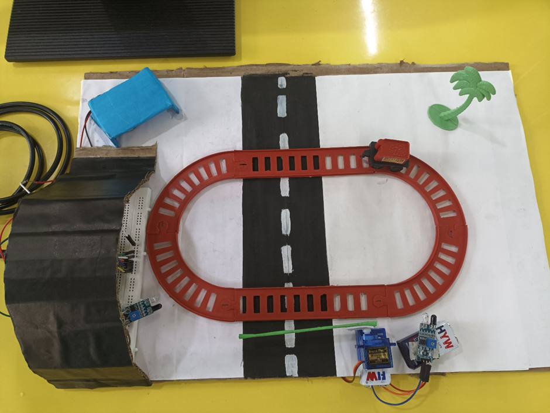
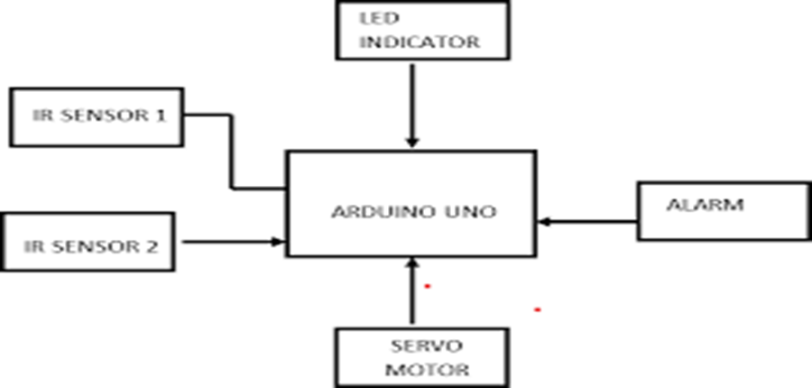
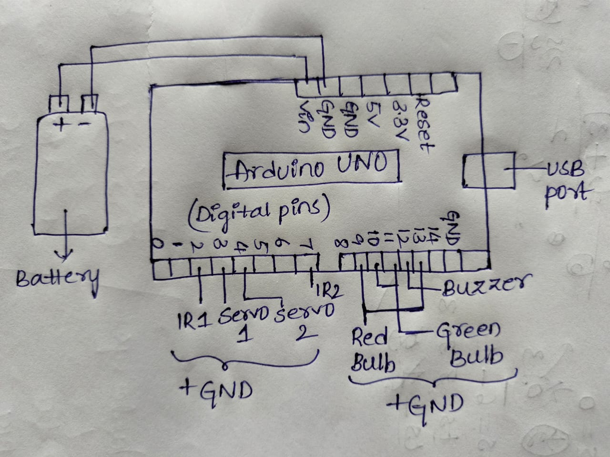

# Automatic-railway-gate-control
This project automates the operation of railway level crossing gates using Arduino Uno, IR sensors, and a servo motor, aiming to reduce human error and prevent railway accidents.

----

## 📁 Table of Contents

- [Overview](docs/00_overview.md)
- [Block Diagram](#block-diagram)
- [Workflow](#workflow)
- [Components Required](#components-required)
- [Code Upload Instructions](#code-upload-instructions)
- [Working Mechanism](#working-mechanism)
- [Screenshots](#screenshots)
- [Code](#code)
- [Status](#status)

---

## 📸 Screenshots

### ✅ Final Output

### 🖥️ Gate Detection result

---

## 🖼️ Block Diagram

## 🧾 Code

👉 See full Arduino code here: [`code.md`](code.md)

---

## Status

Successfully implemented, tested, and demonstrated with real-time sensor input and servo motor response.
